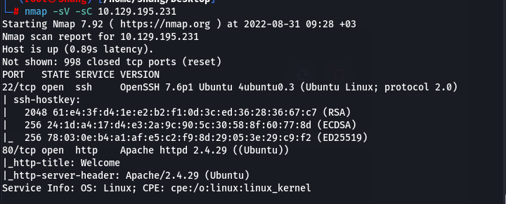

> Completed on `31/08/2022` | OS: `Linux`
> 
> Tools used: `nmap` `burp-suite` `gobuster` `netcat`
> 
<!--more-->

## Collection Information

- First, we will use the `nmap` tool to scan the open port and which servers are running on it.

```bash
nmap -sV -sC 10.129.195.231
```



- Here, we can see information on the open port and the servers are running on it.

> SSH on `22/tcp` | Version: OpenSSH 7.6p1 Ubuntu 4ubuntu0.3
> 
> HTTP on `80/tcp` | Version: Apache http 2.4.29
> 


- Then use the Burp-Suite to catch the website's actions and we see the following path:

```bash
/cdn-cgi/login
```


- I  tried to use a few simple SQL Injection commands but I realized that I could log in with a guest account


- After a while, I realized that ID can change


- I used Burp Suite Intruder for brute-forcing ID


- Then, I get the ID is 30, and I try it…..`Bummm` I get SUPER-ADMIN.
- Pay attention to the user Cookie with two values: Role and User and guess correctly: `AccessID` and `Name`. If we replace the page and we can upload the file, then we succeed, because to upload the file, the role will be `Superadmin`


- Yeah!!! we succeed, next we will see what files can be uploaded and continue to use Burp Suite to catch uploading action and edit the file’s extensions.


- Done, We will find the position where `php-revershell.php` is uploaded and `/uploads`


- Now we need to tell our machine to ‘listen’ for connections from the target computer requested by our shell script (when we trigger it), we’ll used `NetCat`:

```bash
nc -lvnp 4444
```


- Semi stabilizing shell: `python3 -c “import pty;pty.spawn(’/bin/bash’)”`
- Now we will find the user accounts as below


- We switch to  the `robert` account and find flag in the path: `/Home/Desktop/User.txt`


## Privilege Escalation

Once we have successfully logged in as the user Robert, run the ***id*** command to see if this user belongs to any interesting groups. We invoke this step to see if we can use the group's permissions to escalate privileges. Sure enough, this user is a part of the *`bugtracker`* group. Let's run a ***find*** command to see what sort of files/access this group has on the system.

```
find / -type f -group bugtracker 2>/dev/null
```


- Now let's create a temporary binary called cat that well allow us to spawn a shell as root. Run the following commands in sequence:

```
export PATH=/tmp:$PATH
cd /tmp/
echo '/bin/sh' > cat
chmod +x cat
```


- Use ***vim*** to see the flag


***Done🎉***